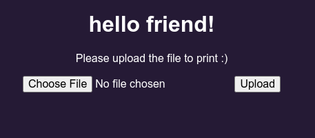

# Print Server (Raspberry Pi) 



Print server is a small project that transforms your Raspberry Pi into a printing
server 

## Installation

Make sure you have flask installed, if not you can just
```bash
    foo@bar:$ pip install flask
```
Then clone the repository and you're set to go.

## Usage

You just need to run:

```bash
    foo@bar:$ python print_server.py
```

And then access to your local ip address from a web browser. (Kind of intuitive
from there)

**NOTE**: Unless you and I have the same printer (pretty unlikely), you must 
change the code in print_server.py, in line 47 you must write down your printer.
Yeah I know we are all lazy here, but come on it takes you like 1 min and then
you are good and set to go.

## Contributing
Pull requests are welcome. For major changes, please open an issue first to 
discuss what you would like to change.

Please make sure to update tests as appropriate.

## Licence
[GPLv3.0](https://www.gnu.org/licenses/gpl-3.0.en.html)
